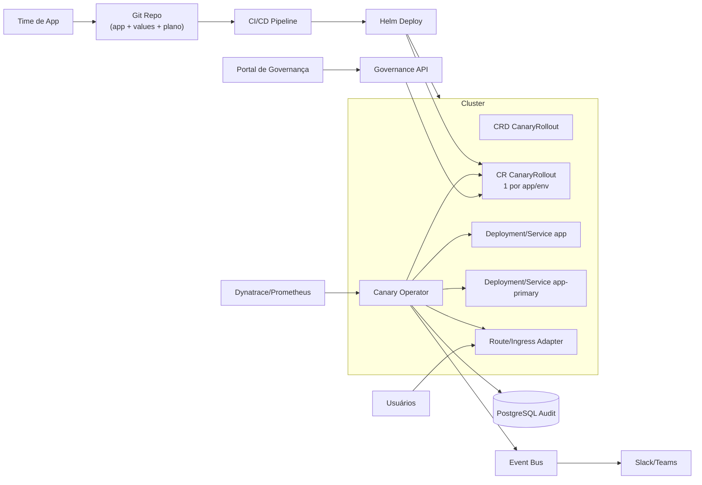
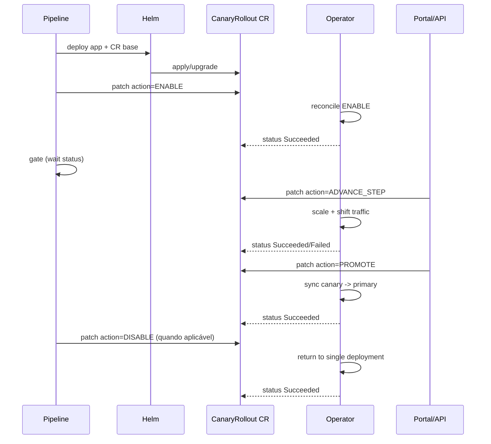
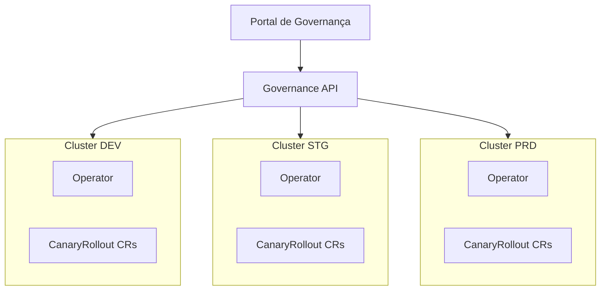

# Arquitetura de Solução Alvo

## Objetivo
Desenhar o estado desejado para canary corporativo com:
- Operator
- CR (`CanaryRollout`) distribuído por Helm
- Portal de Governança
- integração com pipeline, observabilidade e auditoria

## Visão macro

## Princípios de ownership
- Helm:
  - mantém baseline do app
  - cria/atualiza o CR `CanaryRollout`
- Operator:
  - reconcilia ações (`ENABLE`, `ADVANCE_STEP`, `PROMOTE`, `ROLLBACK`, `DISABLE`)
  - gerencia lifecycle de `-primary` e pesos de tráfego
- Portal:
  - aprovações e progressão (ownership de steps = política da empresa)

## Fluxo de controle (alto nível)

## Topologia multi-cluster

## Contrato operacional
- 1 CR por app/ambiente
- pipeline usa gate obrigatório por status do CR
- steps/progressão controlados por política (`TBD` em decisão de governança)

## Caminho de implementação
1. OpenShift primeiro (Route adapter + OLM opcional)
2. estabilização de processo em DEV/STG
3. expansão para Kubernetes (Ingress adapter) mantendo mesmo CR
