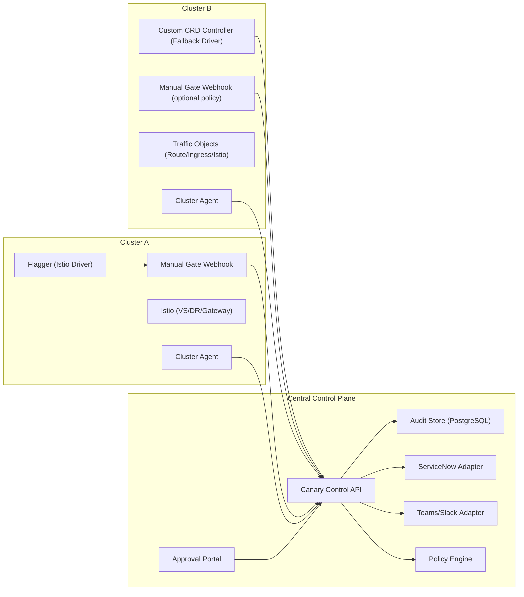

# Blueprint: Istio + Flagger (Primary) with Custom CRD Fallback

## 1) Executive Summary

This blueprint defines a multi-cluster canary platform with two runtime modes:

- **Primary mode (default):** `Flagger + Istio` with centralized governance and mandatory manual approvals.
- **Fallback mode:** `Custom CRD controller` for clusters/scenarios where Flagger/Istio is not viable or where more operational flexibility is required.

The control plane is centralized, while traffic execution is pluggable per cluster.

## 2) Design Goals

- Standardize canary governance across EKS/AKS/ROSA/OpenShift.
- Keep runtime modules decoupled to switch driver per cluster.
- Enforce manual gates for production governance in the primary mode.
- Preserve a flexible fallback path without blocking operations.
- Keep one audit model across both execution drivers.

## 3) Architecture

## 4) Driver Model (Decoupled Execution)

Each cluster has a `cluster-profile` selecting one traffic driver:

- `driver=flagger-istio` (default)
- `driver=custom-crd` (fallback)

Both drivers expose the same logical actions:

- `pause`
- `resume`
- `approve-step`
- `reject-step`
- `rollback`
- `promote`

Both drivers map to a canonical status model:

- `PendingApproval`
- `Progressing`
- `Paused`
- `Failed`
- `Promoted`
- `RolledBack`

## 5) Approval and Gate Policy

### Primary mode (Flagger + Istio)

Manual gates are mandatory:

- `confirm-traffic-increase`
- `confirm-promotion`
- `manual-rollback` (governed rollback)

Webhook status contract:

- `200` approved
- `409` pending (do not proceed)
- `412` rejected or expired (stop flow)

### Fallback mode (Custom CRD)

Policy-driven flexibility:

- `approvalRequired: true|false`
- `progressiveRequired: true|false`
- `allowDirectOps: true|false`

This enables direct cluster operation when explicitly allowed, while preserving centralized audit.

## 6) Required RBAC (per cluster)

Use dedicated service accounts.

### `flagger-sa` (primary mode)

Permissions (`get,list,watch,create,update,patch,delete`) as needed for:

- `canaries.flagger.app`
- `deployments`, `services`, `configmaps`, `events`
- `horizontalpodautoscalers`
- Istio resources (`virtualservices`, `destinationrules`, `gateways`)

### `canary-agent-sa` (all modes)

Read permissions:

- `canaries.flagger.app`, `deployments`, `pods`, `events`
- fallback CRDs (`canaryops.*`) if enabled

Actuation permissions (minimum):

- `patch,update` on `canaries.flagger.app` (pause/resume)
- `patch,update` on fallback CRDs
- `patch,update` on `deployments` only if rollback by policy is enabled

## 7) Security and Networking

- Webhook runs locally in each cluster; Flagger calls local ClusterIP service.
- Webhook egress is restricted to central API + DNS only.
- mTLS or OIDC service auth between webhook/agent and control API.
- NetworkPolicy denies all non-required paths.
- Secret rotation and short token lifetime are mandatory.

## 8) Operational Controls

Central controls (portal/API):

- Global pause by app/environment.
- Cluster freeze window.
- Stuck rollout detection (`Progressing` with no weight change for X minutes).
- Policy action on stuck:
  - pause only
  - pause + incident
  - pause + rollback (if authorized)

## 9) Data and Audit Model

Record immutable events for both drivers:

- who approved/rejected
- what step/action
- when and where (cluster/namespace/app)
- related change/incident ticket
- decision payload and status transition

Suggested tables:

- `approval_requests`
- `approval_events`
- `rollout_actions`
- `idempotency_keys`

## 10) Delivery and Distribution

- Package per-cluster components with Helm.
- Deliver with GitOps per environment/cluster.
- Keep central plane independent lifecycle from cluster drivers.

Suggested configuration split:

- `values-global.yaml`: common policy defaults
- `values-<cluster>.yaml`: driver selection and cluster identity

## 11) Fallback Trigger Criteria

Use `custom-crd` driver when:

- Istio/Flagger not available in the cluster.
- Provider compatibility is insufficient for the ingress/route model.
- Operational policy requires direct non-progressive execution.

All fallback operations must still publish events to the same central audit pipeline.

## 12) Rollout Roadmap

1. **Phase 1:** Primary mode in one EKS dev cluster (`flagger-istio`) with mandatory gates.
2. **Phase 2:** Central policy engine + portal RBAC + ServiceNow integration.
3. **Phase 3:** Add fallback controller (`custom-crd`) in one pilot cluster.
4. **Phase 4:** Expand to AKS/ROSA/OpenShift with per-cluster driver selection.
5. **Phase 5:** Production hardening (SLOs, DR, break-glass controls).

## 13) Key Decisions Captured

- Gateway API is intentionally out of scope for the current plan.
- Primary strategy is Istio + Flagger.
- Custom CRD fallback is an official part of the architecture.
- All modes remain centrally governed and auditable.
