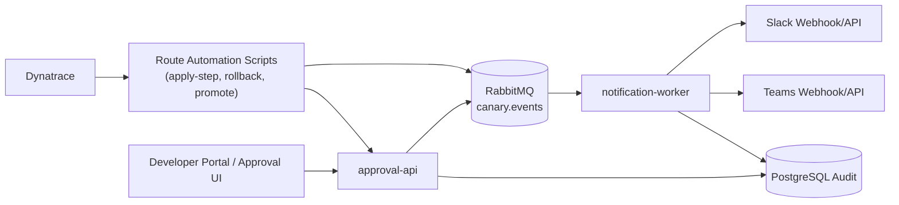
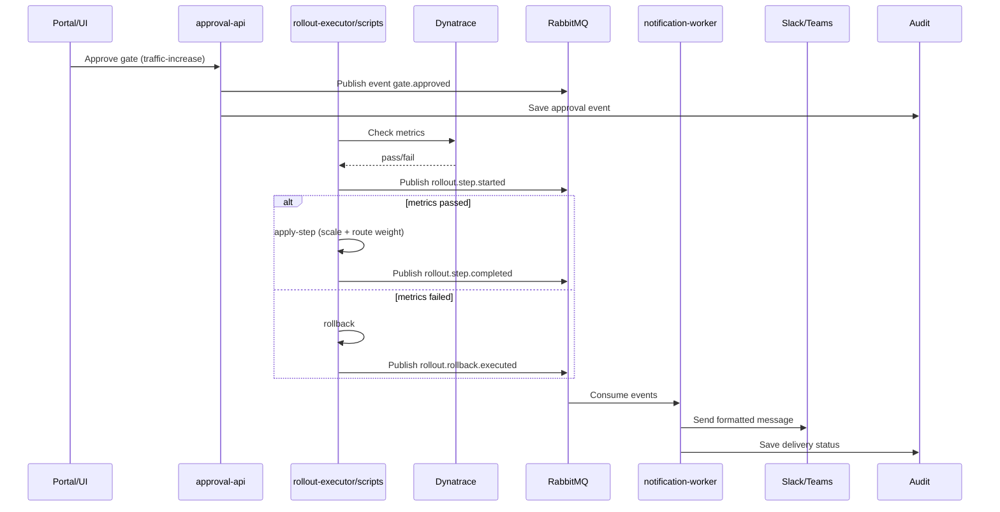

# Canary Notifications Architecture (Slack/Teams)

## Objective
Provide Flagger-like alerts and notifications for OpenShift/Kubernetes canary flows (manual + automated), including approvals, rollout progression, failures, rollback, and promotion.

## Scope
- Works with Route automation and Dynatrace metric gates.
- Works with per-deployment rollout plans.
- Sends notifications to Slack and Microsoft Teams.
- Keeps audit traceability via correlation IDs and actor metadata.

## High-Level Architecture


## Sequence (Typical Progressive Rollout)


## Event Contract (Canonical)
All notifiable events should follow a common schema.

```json
{
  "eventId": "uuid",
  "eventType": "rollout.step.completed",
  "timestamp": "2026-03-07T19:10:00Z",
  "correlationId": "uuid",
  "app": "payments-api",
  "environment": "dev",
  "namespace": "team-a",
  "cluster": "openshift-dev-1",
  "step": "step-25",
  "status": "SUCCESS",
  "actor": "user@company.com",
  "reason": "manual approval",
  "metrics": {
    "errorRate": 0.2,
    "p95Ms": 210
  },
  "links": {
    "runbook": "https://...",
    "dashboard": "https://...",
    "changeRequest": "CHG123456"
  }
}
```

## Notification Types
- `gate.requested`
- `gate.approved`
- `gate.rejected`
- `rollout.step.started`
- `rollout.step.completed`
- `rollout.step.failed`
- `rollout.rollback.executed`
- `rollout.promote.primary.completed`
- `canary.disabled`

## Channel Routing Policy
- `SUCCESS` events -> deployment channel (`#deployments` / Teams Deployments)
- `WARNING` events -> platform ops channel
- `FAILED` / `ROLLBACK` events -> incidents channel (high priority)

Optional per-app overrides:
- `payments-api` -> `#payments-releases`
- `orders-api` -> `#orders-releases`

## Message Template (Recommended)
- Header: `${eventType} | ${app} | ${environment}`
- Body:
  - status
  - step
  - actor
  - weights (stable/canary)
  - replicas (primary/canary)
  - correlationId
- Links:
  - dashboard
  - runbook
  - change request

## Reliability and Safety
- At-least-once delivery from RabbitMQ.
- Idempotency by `eventId` in `notification-worker`.
- Retry with backoff; DLQ on permanent failure.
- Circuit breaker per provider (Slack/Teams).
- Delivery audit table for compliance.

## Security
- Webhook URLs/tokens in Secrets Manager or Kubernetes Secret.
- No sensitive payload in chat messages.
- Include only operational metadata.
- TLS-only outbound requests.

## Observability
Metrics for `notification-worker`:
- `notifications_sent_total{channel,status}`
- `notifications_failed_total{channel,error_type}`
- `notification_delivery_latency_ms`
- `dlq_size`

Logs:
- Structured JSON with `correlationId`, `eventId`, `app`, `env`.

## Integration with Current Scripts
Scripts should emit events at key points:
- `apply-step.sh`: start, success, failure
- `rollback.sh`: executed
- `promote-to-primary.sh`: start, success, failure
- `disable-canary.sh`: start, success

This can be done by calling a lightweight event endpoint in `approval-api` or pushing directly to RabbitMQ via a helper CLI.

## MVP Implementation Plan
1. Add event publisher endpoint to `approval-api`.
2. Add `notification-worker` with Slack + Teams adapters.
3. Add event emission calls in route automation scripts.
4. Add delivery dashboards and failure alerts.
5. Validate with one app (`payments-api`) in `dev`.
