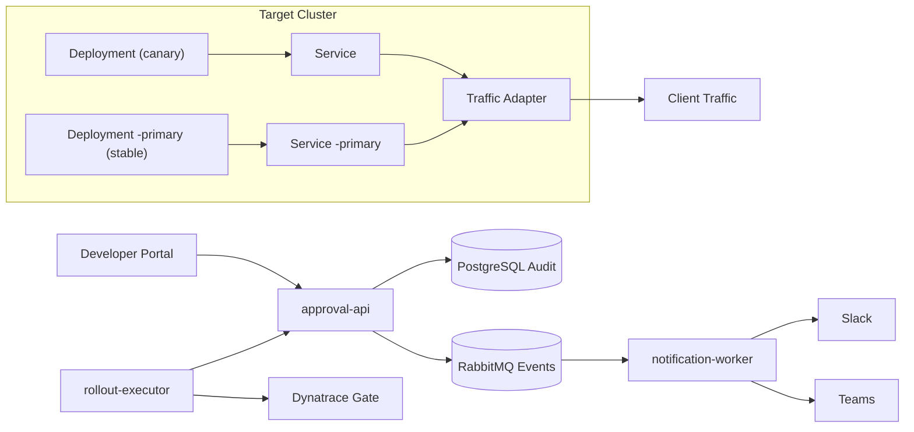
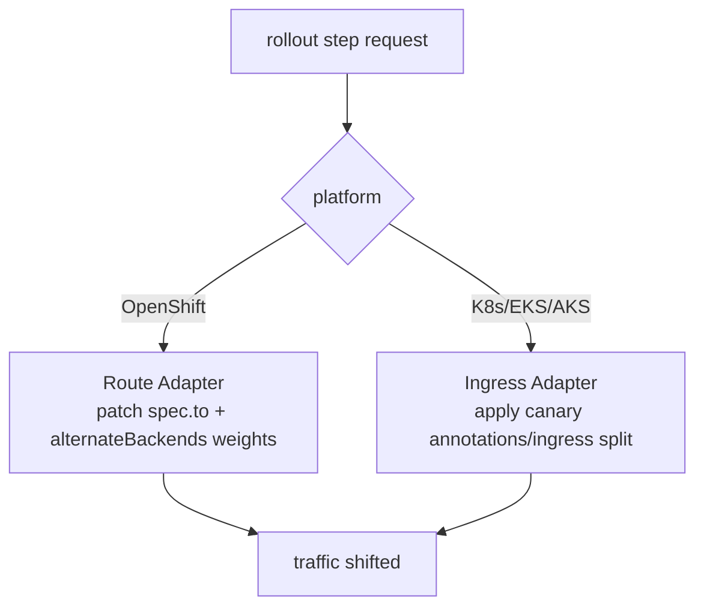
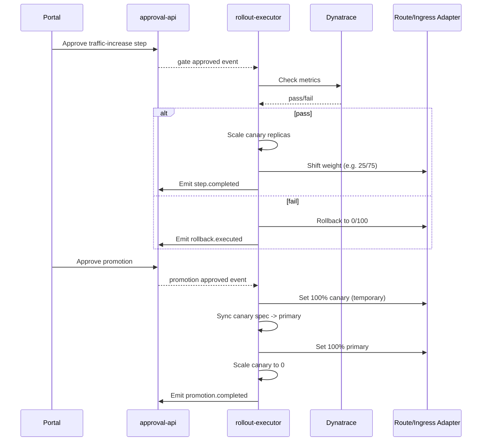

# Unified Canary Architecture: OpenShift + Kubernetes (Without Flagger Runtime)

## Objective
Define a single canary operating model that works across:
- OpenShift (Route-based traffic)
- Kubernetes/EKS/AKS (Ingress-based traffic)

while keeping:
- `Deployment` as the standard workload object
- manual gates and audit trail
- optional Dynatrace-based automatic progression
- Flagger-like promotion behavior with `-primary`

## Core Principle
Keep one **control flow** and swap only the **traffic adapter**:
- OpenShift adapter -> Route weights
- Kubernetes adapter -> Ingress canary controls

For PoC A ownership:
- Helm does not manage `<app>-primary` resources.
- Rollout scripts/executor own `<app>-primary` create/update/remove lifecycle.

## Unified Component Model

## Traffic Adapter Layer

## Flagger-like Lifecycle (Platform-Agnostic)
1. **Enable canary**
- Create `<app>-primary` deployment/service from current `<app>`.
- Route 100% to `<app>-primary`, 0% to `<app>`.

2. **Progressive rollout**
- For each step: scale canary capacity first, then shift traffic.
- Optional Dynatrace gate before step.

3. **Promotion (two-phase)**
- Temporary 100% to canary.
- Sync canary spec to `<app>-primary`.
- Route back 100% to `<app>-primary`.
- Scale canary to `0`.

4. **Disable canary**
- Route 100% to `<app>`.
- Optionally remove `<app>-primary` objects.

## Sequence: Progressive + Promote

## Data and Governance Model
Per deployment (not global):
- rollout steps and weights
- metric thresholds
- approval policy
- channel routing for notifications

Suggested storage:
- Helm values per deployment/environment
- rollout plan file per deployment/environment

## Mapping Table (OpenShift vs Kubernetes)
| Capability | OpenShift | Kubernetes/EKS/AKS |
|---|---|---|
| Stable traffic object | `Route` | `Ingress` |
| Weight update | `spec.to.weight` + `alternateBackends[].weight` | NGINX canary annotations or split ingress resources |
| Workload object | `Deployment` | `Deployment` |
| Stable naming | `<app>-primary` | `<app>-primary` |
| Canary naming | `<app>` | `<app>` |

## Operational Modes
1. **Manual mode**
- Step execution only after human approval.

2. **Dynatrace-assisted mode**
- Human approval + pre-step metric gate.
- Auto rollback on threshold breach.

3. **Canary disabled mode**
- Single deployment path for standard rolling updates.

## Non-Functional Requirements
- Idempotent step execution.
- Single active rollout lock per app/env.
- Full audit trail (who/when/why/what).
- Notification delivery retries + DLQ.
- Read-only status APIs for dashboard.

## Risks and Mitigations
- Drift between Helm and runtime objects:
  - Mitigation: strict ownership boundary (Helm = config only, scripts/executor = transient canary runtime objects).
- Misconfigured weights per app:
  - Mitigation: plan validation (`weights sum = 100`).
- No autoscaling in cluster:
  - Mitigation: auto replica formula from stable replicas + safety margin.

## Recommended Adoption Path
1. Start with OpenShift Route adapter (current constraints).
2. Add Kubernetes Ingress adapter with same control flow.
3. Standardize dashboard and approvals across both platforms.
4. Optionally migrate specific environments to Flagger native where feasible.
