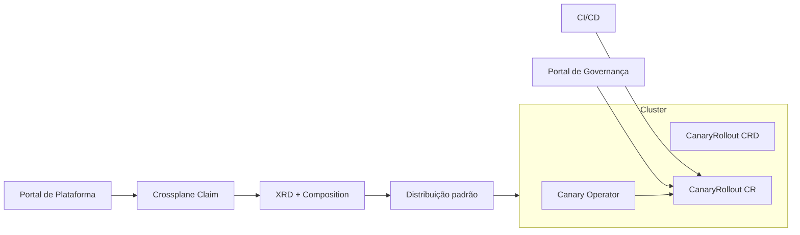

# Crossplane para Distribuição do Canary Operator

## Resposta curta
Sim, dá para usar Crossplane para distribuir a solução em escala.

Mas com separação clara de responsabilidades:
- Crossplane: provisionamento e padronização de plataforma
- Canary Operator: execução do canary (`ENABLE`, `ADVANCE_STEP`, `PROMOTE`, `ROLLBACK`, `DISABLE`)

## Onde Crossplane ajuda muito
1. Provisionar recursos de infraestrutura (clusters, rede, IAM, etc.).
2. Padronizar instalação de componentes por ambiente/cluster:
- CRD `CanaryRollout`
- Canary Operator
- RBAC/policies padrão
3. Expor autosserviço para times via claims/compositions.
4. Garantir consistência multi-cluster com menos trabalho manual.

## Onde Crossplane não deve ser o motor principal
Não usar Crossplane para orquestrar step-by-step de progressive delivery.

Por quê:
- lógica de rollout canary exige state machine específica
- decisões de promoção/rollback dependem de políticas e gates de negócio
- isso pertence ao controller de domínio (Canary Operator)

## Arquitetura recomendada

## Modelo de responsabilidade (recomendado)
- Crossplane:
  - instala e mantém baseline da plataforma
  - publica stacks padronizadas por ambiente
- Helm/GitOps:
  - entrega app + CR base por app/ambiente
- Canary Operator:
  - reconcilia ações de canary e atualiza status
- Governança:
  - aprova e aciona progressão conforme política

## Exemplo prático de uso
1. Claim de ambiente criado no portal.
2. Composition instala Operator + CRD + RBAC no cluster do time.
3. Pipeline do app aplica CR base (`CanaryRollout`).
4. Pipeline/portal faz patch de ações no CR.
5. Operator executa rollout e publica status/events.

## Benefícios esperados
- Menor tempo de bootstrap por cluster/time.
- Menos drift entre ambientes.
- Governança centralizada com autonomia por time.
- Caminho claro para OpenShift e Kubernetes com o mesmo contrato de CR.

## Riscos e mitigação
- Complexidade extra inicial de Crossplane:
  - Mitigação: começar por uma composition mínima (Operator + CRD + RBAC).
- Sobreposição com GitOps:
  - Mitigação: definir fronteira (Crossplane = plataforma, GitOps/Helm = app + CR).

## Conclusão
Crossplane é excelente para distribuir e padronizar a solução.
O motor de canary continua sendo o Canary Operator.
Esse modelo permite escala multi-cluster sem perder governança.
