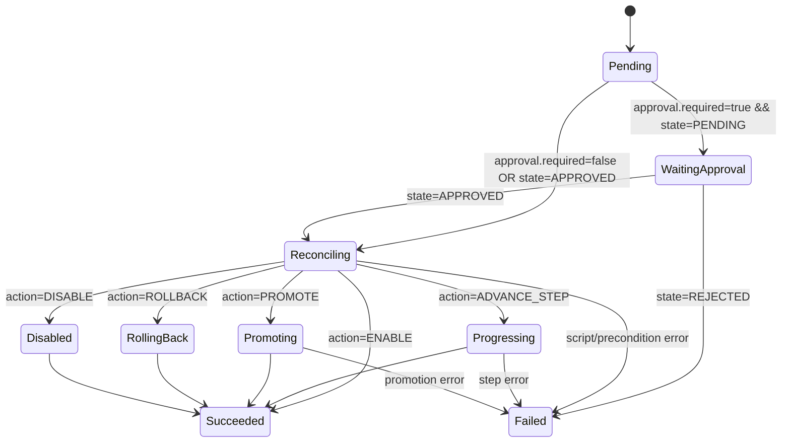

# OpenShift CanaryRollout CRD - Phase 1 Design

## Scope
Phase 1 introduces a declarative control object for OpenShift canary orchestration, similar to Flagger behavior but keeping `Deployment` + `Route` and existing `oc` automation scripts.

## Why
Current flow works through pipeline inputs/scripts. The CRD adds:
- a single source of desired canary action
- auditable status and lifecycle in-cluster
- simpler integration for dashboards and approval APIs

## CRD Contract
Group/version:
- `canary.company.io/v1alpha1`

Kind:
- `CanaryRollout`

Main spec fields:
- `spec.targetRef`: app/namespace/route target
- `spec.planRef`: rollout plan reference
- `spec.action`: `ENABLE|ADVANCE_STEP|PROMOTE|ROLLBACK|DISABLE`
- `spec.stepName`: required for `ADVANCE_STEP`
- `spec.mode`: `MANUAL|DYNATRACE`
- `spec.approval`: gate state (`PENDING|APPROVED|REJECTED`)
- `spec.request`: metadata (who/why/change/idempotency)
- `spec.disablePolicy`: behavior for disable flow

Main status fields:
- `status.phase`
- `status.currentStep`
- `status.traffic.{stableWeight,canaryWeight}`
- `status.replicas.{stable,canary}`
- `status.conditions[]`
- `status.history[]`

## Reconciliation Model (Phase 2 target)
Controller watches `CanaryRollout` changes and performs:
1. Validate object and action preconditions.
2. Check manual gate (`spec.approval.state`).
3. Execute mapped script/action.
4. Update `status` and append history record.
5. Requeue if waiting approval or transient error.

Script mapping:
- `ENABLE` -> `bootstrap-primary.sh`
- `ADVANCE_STEP` -> `apply-step.sh`
- `PROMOTE` -> `promote-to-primary.sh`
- `ROLLBACK` -> `rollback.sh`
- `DISABLE` -> `disable-canary.sh`

## State Machine

## Integration Points
- Approval API updates `spec.approval.state` and metadata.
- Notification worker consumes status transitions and emits Slack/Teams events.
- Dashboard queries CR status from Kubernetes/OpenShift API using service account RBAC.

## RBAC (Controller)
Controller service account needs:
- read/write `canaryrollouts` + `canaryrollouts/status`
- get/list/watch/patch on `deployments`, `services`, `routes`
- create `events` in namespace

## Operational Rules
- One active `CanaryRollout` per app/environment.
- Idempotent execution based on `spec.request.idempotencyKey`.
- `spec.suspend=true` pauses reconciliation.
- Helm remains config-only; runtime `-primary` lifecycle stays with automation/controller.

## Deliverables in This Phase
- CRD manifest
- Action example manifests
- architecture/state machine documentation

Phase 2 will implement the actual controller/operator runtime.
